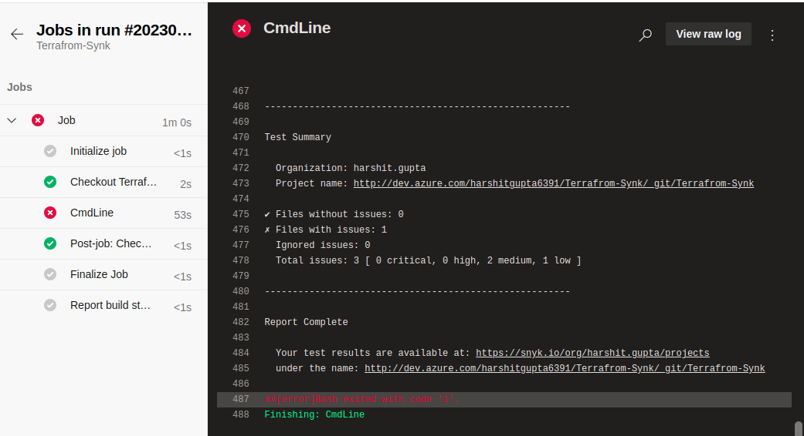

## Description

Here, In this template we will learn how to check vulnerabilities in IaC using Snyk

---
### Prerequisite

1. ADO Account
2. Snyk Account

---
### Steps

Step 1:- Create a project in Azure DevOps.

Step 2:- Go to `Organization setting->Extensions`. Click on Browse marketplace and add Snyk extension. 

Step 3:- Go to the `Project setting-> Service connections-> New service connection` search Snyk Authentication.

Step 4:- Fill all the details :

* Snyk API Token : Go to Account setting->General (click to show)
* Grant access to all the pipelines. 

Step 5:- Add project to the ADO github.

Step 6:- Go to `Pipeline->New Pipeline->Azure Repos Git` select the project then click on Starter pipeline.

Step 7:- Then template will be provided, save and add Task in the pipeline , search for Snyk and fill the details:

Step 8:- Run the pipeline

---
### Output

Here is the output the [azure-pipelines.yml](Snyk/integration%20with%20Terraform%2Fazure-pipelines.yml) script

